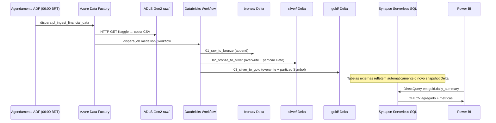

# Arquitetura — Plataforma de Dados End-to-End Financeiro

## Fluxo Geral

```mermaid
flowchart LR
    subgraph SOURCE["Fonte de Dados"]
        K["Kaggle\nadhoppin/financial-data\nOHLCV CSV"]
    end

    subgraph INGEST["Ingestao — Azure Data Factory"]
        ADF["pl_ingest_financial_data\nHTTP Copy Activity"]
    end

    subgraph STORAGE["Azure Data Lake Storage Gen2"]
        RAW["raw/\nfinancial-data/*.csv"]
        BRONZE["bronze/\nfinancial_data/ (Delta)"]
        SILVER["silver/\nfinancial_data/ (Delta)"]
        GOLD_D["gold/\nfinancial_data/ (Delta)"]
        GOLD_S["gold/\ndaily_summary/ (Delta)"]
    end

    subgraph TRANSFORM["Transformacao — Azure Databricks"]
        NB1["01_raw_to_bronze\n+ colunas de metadados"]
        NB2["02_bronze_to_silver\nlimpar, enriquecer, particionar"]
        NB3["03_silver_to_gold\nMA7, MA30, retornos com lag"]
    end

    subgraph ANALYTICS["Analytics — Azure Synapse Serverless SQL"]
        EXT["Tabelas Externas\nbronze / silver / gold"]
        VIEWS["Views de Analytics\nvw_rolling_volatility\nvw_symbol_performance\nvw_data_quality_check"]
    end

    subgraph VIZ["Visualizacao — Power BI"]
        PBI["financial_dashboard\n2 paginas: Visao Geral + Analise Tecnica"]
    end

    K -->|"HTTP GET"| ADF
    ADF -->|"CSV"| RAW
    RAW --> NB1 --> BRONZE
    BRONZE --> NB2 --> SILVER
    SILVER --> NB3 --> GOLD_D
    NB3 --> GOLD_S
    GOLD_D --> EXT
    GOLD_S --> EXT
    EXT --> VIEWS
    VIEWS -->|"DirectQuery"| PBI
```

## Camadas Medallion

| Camada | Formato | Caminho | Proposito |
|--------|---------|---------|-----------|
| **Raw** | CSV | `raw/financial-data/*.csv` | Zona de pouso — arquivos como recebidos do ADF |
| **Bronze** | Delta Lake | `bronze/financial_data/` | Dados brutos + metadados de ingestao; somente append |
| **Silver** | Delta Lake | `silver/financial_data/` | Tipado, deduplicado, enriquecido; particionado por `Date` |
| **Gold Detail** | Delta Lake | `gold/financial_data/` | Linha a linha com MA7/MA30/lag; particionado por `Symbol` |
| **Gold Summary** | Delta Lake | `gold/daily_summary/` | Metricas diarias agregadas; fonte do Power BI |

## Diagrama de Sequencia — Execucao Diaria do Pipeline

---

## Registros de Decisao de Arquitetura (ADRs)

### ADR-001 — Delta Lake como formato unificado de armazenamento

**Status:** Aceito

**Contexto:** Precisamos de um formato que suporte transacoes ACID, evolucao de schema e leituras eficientes tanto pelo Databricks (Spark) quanto pelo Synapse Analytics (SQL serverless).

**Decisao:** Usar Delta Lake nas tres camadas medallion (bronze, silver, gold).

**Consequencias:**
- O Synapse serverless SQL le o Delta via `EXTERNAL TABLE ... FORMAT=DELTA`, aproveitando o transaction log do Delta para schema e snapshot mais recente.
- Time-travel (`VERSION AS OF`, `TIMESTAMP AS OF`) disponivel para depuracao e reprocessamento.
- O modo append no bronze garante que nenhum dado seja perdido em falhas de reprocessamento; overwrite em silver/gold e seguro pois bronze e a fonte da verdade.

---

### ADR-002 — Arquitetura medallion (bronze / silver / gold)

**Status:** Aceito

**Contexto:** Dados financeiros exigem separacao clara entre ingestao bruta, dados limpos prontos para analytics e agregacoes de negocio.

**Decisao:** Medallion de tres camadas com contratos bem definidos em cada fronteira:
- Bronze = dados brutos + metadados apenas
- Silver = tipado para negocio, deduplicado, enriquecido com metricas derivadas (retorno diario, amplitude intradiaria)
- Gold = agregado e janelado (MA7, MA30, retornos com lag) — unica camada que o Power BI acessa

**Consequencias:**
- Silver e a fronteira de reprocessamento: o bronze nunca e transformado in-place. Se um bug de transformacao silver for encontrado, reexecutamos 02_bronze_to_silver sem re-ingerir.
- Gold e a camada de desempenho — as queries do Synapse batem em dados pre-agregados, nao em linhas brutas.

---

### ADR-003 — Synapse Serverless SQL (nao Dedicated Pool) para analytics

**Status:** Aceito

**Contexto:** Precisamos de acesso SQL ao Delta Lake para o DirectQuery do Power BI e analises ad-hoc, sem o custo de um pool SQL dedicado 24/7.

**Decisao:** Synapse Serverless SQL com tabelas externas apontando para o Delta Lake no ADLS.

**Consequencias:**
- Custo zero de provisionamento em idle — paga-se por query (TB escaneado).
- Sem ETL para dentro do Synapse — Delta Lake e o armazenamento autoritativo; Synapse le diretamente.
- O DirectQuery do Power BI acessa o Synapse, que le do ADLS; frescor dos dados = cadencia do pipeline (diario as 06:00 BRT).

---

### ADR-004 — ADF para ingestao, nao um script customizado

**Status:** Aceito

**Contexto:** A ingestao inicial do Kaggle poderia ser feita com um script Python simples. Porem, precisamos de logica de retry, monitoramento, lineage e triggers agendados.

**Decisao:** Azure Data Factory para ingestao (HTTP → copia ADLS) com autenticacao via Managed Identity no ADLS e segredos no Azure Key Vault.

**Consequencias:**
- ADF oferece retry nativo, historico de execucoes e integracao com alertas do Azure Monitor.
- Sem credenciais no codigo — ADF e Databricks autenticam via Managed Identity.
- O script `scripts/download_kaggle_data.py` e mantido como utilitario local do desenvolvedor (carga inicial, backfills), nao como caminho de producao.

---

### ADR-005 — Formato Power BI PBIP (nao .pbix)

**Status:** Aceito

**Contexto:** `.pbix` e um arquivo binario — nao e diffavel no git e nao e revisavel em PRs.

**Decisao:** Usar o formato Power BI Project (`.pbip`), que armazena o semantic model (`model.bim`) e a definicao do relatorio (`report.json`) como arquivos JSON simples.

**Consequencias:**
- Historico git completo para medidas DAX, layout do relatorio e alteracoes no modelo de dados.
- CI pode fazer lint ou validar a estrutura do model.bim.
- Requer Power BI Desktop junho/2023 ou superior para abrir.
