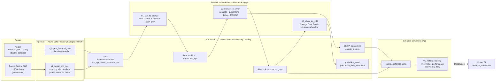
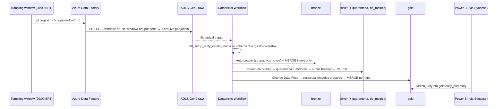

# Arquitetura — Plataforma de Dados End-to-End Financeiro

## Fluxo Geral

## Camadas Medallion

| Camada | Tabela (UC) | Caminho | Escrita | Proposito |
|--------|-------------|---------|---------|-----------|
| **Raw** | — | `raw/financial-data/`, `raw/bcb_sgs/` | ADF | Zona de pouso, arquivos como recebidos |
| **Bronze** | `bronze.ohlcv`, `bronze.bcb_sgs` | `bronze/financial_data/`, `bronze/bcb_sgs/` | MERGE insert-only por `_ingestion_key` | Valores brutos (string) + metadados de ingestao |
| **Silver** | `silver.ohlcv`, `silver.bcb_sgs` | `silver/financial_data/`, `silver/bcb_sgs/` | MERGE por chave de negocio | Tipado, validado, deduplicado; Change Data Feed ligado |
| **Quarentena** | `silver.*_quarantine` | `silver/_quarantine/...` | MERGE insert-only | Registros rejeitados + `_rejection_reason` |
| **Ops** | `ops.dq_metrics` | `silver/_ops/dq_metrics/` | MERGE por (tabela, run, batch) | Metricas de qualidade por micro-batch |
| **Gold** | `gold.ohlcv_detail`, `gold.ohlcv_daily_summary` | `gold/financial_data/`, `gold/daily_summary/` | MERGE substituindo a fatia do simbolo | MA7/MA30, retornos; fonte do Power BI |

Nenhuma tabela e particionada; o layout e otimizado com `OPTIMIZE ... ZORDER BY` ao fim de cada execucao.

## Diagrama de Sequencia — Execucao Diaria do Pipeline

---

## Registros de Decisao de Arquitetura (ADRs)

### ADR-001 — Delta Lake como formato unificado de armazenamento

**Status:** Aceito

**Contexto:** Precisamos de um formato que suporte transacoes ACID, evolucao de schema e leituras eficientes tanto pelo Databricks (Spark) quanto pelo Synapse Analytics (SQL serverless).

**Decisao:** Usar Delta Lake nas tres camadas medallion (bronze, silver, gold).

**Consequencias:**
- O Synapse serverless SQL le o Delta via `EXTERNAL TABLE ... FORMAT=DELTA`, aproveitando o transaction log do Delta para schema e snapshot mais recente.
- Time-travel (`VERSION AS OF`, `TIMESTAMP AS OF`) disponivel para depuracao e reprocessamento.
- Todas as escritas sao `MERGE` (ver ADR-006): nenhuma camada e sobrescrita por inteiro, e a bronze continua sendo a fonte da verdade para reprocessamento.

---

### ADR-002 — Arquitetura medallion (bronze / silver / gold)

**Status:** Aceito

**Contexto:** Dados financeiros exigem separacao clara entre ingestao bruta, dados limpos prontos para analytics e agregacoes de negocio.

**Decisao:** Medallion de tres camadas com contratos bem definidos em cada fronteira:
- Bronze = dados brutos + metadados apenas
- Silver = tipado para negocio, deduplicado, enriquecido com metricas derivadas (retorno diario, amplitude intradiaria)
- Gold = agregado e janelado (MA7, MA30, retornos com lag) — unica camada que o Power BI acessa

**Consequencias:**
- Silver e a fronteira de reprocessamento: o bronze nunca e transformado in-place. Para corrigir um bug de transformacao, basta apagar o checkpoint da silver e reexecutar 02_bronze_to_silver — o MERGE torna o reprocessamento seguro.
- Gold e a camada de desempenho — as queries do Synapse batem em dados pre-agregados, nao em linhas brutas.

---

### ADR-003 — Synapse Serverless SQL (nao Dedicated Pool) para analytics

**Status:** Aceito

**Contexto:** Precisamos de acesso SQL ao Delta Lake para o DirectQuery do Power BI e analises ad-hoc, sem o custo de um pool SQL dedicado 24/7.

**Decisao:** Synapse Serverless SQL com tabelas externas apontando para o Delta Lake no ADLS.

**Consequencias:**
- Custo zero de provisionamento em idle — paga-se por query (TB escaneado).
- Sem ETL para dentro do Synapse — Delta Lake e o armazenamento autoritativo; Synapse le diretamente.
- O DirectQuery do Power BI acessa o Synapse, que le do ADLS; frescor dos dados = cadencia do pipeline (diario as 06:00 BRT).

---

### ADR-004 — ADF para ingestao, nao um script customizado

**Status:** Aceito

**Contexto:** A ingestao inicial do Kaggle poderia ser feita com um script Python simples. Porem, precisamos de logica de retry, monitoramento, lineage e triggers agendados.

**Decisao:** Azure Data Factory para ingestao (HTTP → copia ADLS) com autenticacao via Managed Identity no ADLS. O unico segredo (API do Kaggle) fica no Azure Key Vault.

**Consequencias:**
- ADF oferece retry nativo, historico de execucoes e integracao com alertas do Azure Monitor.
- Sem credenciais no codigo — ADF, Databricks (access connector, ADR-007) e Synapse autenticam via Managed Identity.
- O ADF so pousa arquivos; o job Databricks e disparado pela chegada deles (file arrival trigger), sem acoplamento entre as ferramentas.
- O script `scripts/download_kaggle_data.py` e mantido como utilitario local do desenvolvedor (carga inicial, backfills), nao como caminho de producao.

---

### ADR-005 — Formato Power BI PBIP (nao .pbix)

**Status:** Aceito

**Contexto:** `.pbix` e um arquivo binario — nao e diffavel no git e nao e revisavel em PRs.

**Decisao:** Usar o formato Power BI Project (`.pbip`), com o semantic model em TMDL (um arquivo por tabela) e a definicao do relatorio em `report.json`. `cache.abf` e `localSettings.json` ficam no `.gitignore`.

**Consequencias:**
- Historico git completo para medidas DAX, layout do relatorio e alteracoes no modelo de dados.
- CI pode fazer lint ou validar a estrutura do modelo TMDL.
- Requer Power BI Desktop junho/2023 ou superior para abrir.

---

### ADR-006 — Escritas idempotentes e incrementais (MERGE em todas as camadas)

**Status:** Aceito (substitui "bronze em append, silver/gold em overwrite")

**Contexto:** Append sem chave na bronze duplicava dados a cada reexecucao; overwrite total na silver/gold reprocessava todo o historico e nao era incremental; `dropDuplicates` nao define qual registro sobrevive.

**Decisao:**
- Bronze: Auto Loader + `MERGE` insert-only por `_ingestion_key = sha2(arquivo de origem + conteudo)`.
- Silver: stream da bronze + `MERGE` por chave de negocio; deduplicacao por window ordenada por `(_ingested_at, _source_file, _ingestion_key)`, e o mesmo criterio no `WHEN MATCHED AND <mais novo>`.
- Gold: Change Data Feed da silver; recalcula o historico apenas dos simbolos afetados e substitui a fatia com `WHEN NOT MATCHED BY SOURCE DELETE`.

**Consequencias:**
- Reexecutar qualquer etapa, ou reprocessar um batch apos falha, produz o mesmo estado (coberto por `tests/integration`).
- Uma versao antiga que chegue atrasada nao sobrescreve a versao mais nova.
- Custo: MERGE e mais caro que append; irrelevante neste volume e compensado por processar so o delta.

---

### ADR-007 — Unity Catalog com access connector (sem mounts nem service principal com secret)

**Status:** Aceito (substitui `00_setup_mounts`)

**Contexto:** Mounts no DBFS e service principal com client secret estao depreciados pela Databricks e exigem rotacao de segredo.

**Decisao:** Access connector (managed identity) com `Storage Blob Data Contributor`, storage credential, uma external location por container e catalogo `financial` com schemas `bronze/silver/gold/ops`, tudo em Terraform (`infra/modules/unity_catalog`). As tabelas sao **externas** para continuarem legiveis pelo Synapse.

**Consequencias:**
- Nenhum segredo de storage no workspace; governanca e lineage do Unity Catalog.
- Tabelas sem deletion vectors e sem liquid clustering (o Synapse Serverless le apenas Delta reader v1); layout via ZORDER.

---

### ADR-008 — Data contracts com enforcement e quarentena

**Status:** Aceito (substitui `overwriteSchema=true` e o descarte silencioso de linhas)

**Contexto:** `overwriteSchema=true` aceitava qualquer mudanca de schema; linhas invalidas eram descartadas e apenas impressas.

**Decisao:** Schemas declarados em `src/transforms/contracts.py`, usados para gerar o DDL, validar todo DataFrame antes da escrita e validar as tabelas no setup. Raw lido como string com `_rescued_data`. Registros invalidos vao para tabelas de quarentena com o motivo; cada batch registra metricas em `ops.dq_metrics`, e uma taxa de quarentena acima do limite falha o job antes de publicar na silver.

**Consequencias:**
- Mudanca de schema exige mudanca versionada no contrato (revisada em PR).
- A qualidade e observavel (`ops.vw_dq_daily`, `ops.vw_quarantine_reasons`) e alarmavel (falha do job → e-mail).

---

### ADR-009 — Banco Central (SGS) como fonte incremental

**Status:** Aceito

**Contexto:** O dataset do Kaggle e estatico — carregado uma vez, nao exercita carga incremental.

**Decisao:** Ingerir diariamente series do SGS (PTAX, Selic, CDI, meta Selic) com tumbling window trigger. Cada janela busca os ultimos 7 dias e grava um arquivo deterministico por serie e janela. O Kaggle permanece como backfill historico de OHLCV.

**Consequencias:**
- A sobreposicao entre janelas cobre fins de semana, feriados e revisoes do BCB; o MERGE em `(series_code, ref_date)` a torna inofensiva.
- Reexecutar uma janela sobrescreve o mesmo arquivo; a chave de ingestao descarta o que nao mudou.
- Backfill: um `startTime` no passado gera as janelas anteriores automaticamente.
