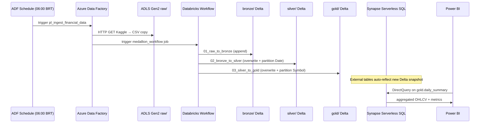

# Architecture — Financial Data End-to-End Platform

## High-Level Flow

```mermaid
flowchart LR
    subgraph SOURCE["Data Source"]
        K["Kaggle\nadhoppin/financial-data\nOHLCV CSV"]
    end

    subgraph INGEST["Ingestion — Azure Data Factory"]
        ADF["pl_ingest_financial_data\nHTTP Copy Activity"]
    end

    subgraph STORAGE["Azure Data Lake Storage Gen2"]
        RAW["raw/\nfinancial-data/*.csv"]
        BRONZE["bronze/\nfinancial_data/ (Delta)"]
        SILVER["silver/\nfinancial_data/ (Delta)"]
        GOLD_D["gold/\nfinancial_data/ (Delta)"]
        GOLD_S["gold/\ndaily_summary/ (Delta)"]
    end

    subgraph TRANSFORM["Transformation — Azure Databricks"]
        NB1["01_raw_to_bronze\n+ metadata cols"]
        NB2["02_bronze_to_silver\nclean, enrich, partition"]
        NB3["03_silver_to_gold\nMA7, MA30, lag returns"]
    end

    subgraph ANALYTICS["Analytics — Azure Synapse Serverless SQL"]
        EXT["External Tables\nbronze / silver / gold"]
        VIEWS["Analytics Views\nvw_rolling_volatility\nvw_symbol_performance\nvw_data_quality_check"]
    end

    subgraph VIZ["Visualization — Power BI"]
        PBI["financial_dashboard\n2 pages: Overview + Technical"]
    end

    K -->|"HTTP GET"| ADF
    ADF -->|"CSV"| RAW
    RAW --> NB1 --> BRONZE
    BRONZE --> NB2 --> SILVER
    SILVER --> NB3 --> GOLD_D
    NB3 --> GOLD_S
    GOLD_D --> EXT
    GOLD_S --> EXT
    EXT --> VIEWS
    VIEWS -->|"DirectQuery"| PBI
```

## Medallion Layers

| Layer | Format | Path | Purpose |
|-------|--------|------|---------|
| **Raw** | CSV | `raw/financial-data/*.csv` | Landing zone — files as-is from ADF |
| **Bronze** | Delta Lake | `bronze/financial_data/` | Raw data + ingestion metadata; append-only |
| **Silver** | Delta Lake | `silver/financial_data/` | Typed, deduplicated, enriched; partitioned by `Date` |
| **Gold Detail** | Delta Lake | `gold/financial_data/` | Per-row with MA7/MA30/lag; partitioned by `Symbol` |
| **Gold Summary** | Delta Lake | `gold/daily_summary/` | Aggregated daily metrics; Power BI source |

## Sequence Diagram — Daily Pipeline Run

---

## Architecture Decision Records

### ADR-001 — Delta Lake as the unified storage format

**Status:** Accepted

**Context:** We need a format that supports ACID transactions, schema evolution, and efficient reads from both Databricks (Spark) and Synapse Analytics (serverless SQL).

**Decision:** Use Delta Lake for all three medallion layers (bronze, silver, gold).

**Consequences:**
- Synapse serverless SQL reads Delta via `EXTERNAL TABLE ... FORMAT=DELTA`, which leverages the Delta transaction log for schema and latest snapshot.
- Time-travel (`VERSION AS OF`, `TIMESTAMP AS OF`) is available for debugging and reprocessing.
- Append-mode on bronze means no data loss from reprocessing failures; overwrite on silver/gold is safe because bronze is the source of truth.

---

### ADR-002 — Medallion architecture (bronze / silver / gold)

**Status:** Accepted

**Context:** Financial data requires distinct separation between raw ingestion, cleansed analytics-ready data, and business aggregations.

**Decision:** Three-layer medallion with clearly defined contracts at each boundary:
- Bronze = raw + metadata only
- Silver = business-typed, deduplicated, enriched with derived metrics (daily return, intraday range)
- Gold = aggregated and windowed (MA7, MA30, lag returns) — the only layer Power BI touches

**Consequences:**
- Silver is the reprocessing boundary: bronze is never transformed in-place. If a silver transformation bug is found, we rerun 02_bronze_to_silver without re-ingesting.
- Gold is the performance layer — Synapse queries hit pre-aggregated data, not raw rows.

---

### ADR-003 — Synapse Serverless SQL (not Dedicated Pool) for analytics

**Status:** Accepted

**Context:** We need SQL-based access to Delta Lake for Power BI DirectQuery and ad-hoc analysis, without the cost of a 24/7 dedicated SQL pool.

**Decision:** Synapse Serverless SQL with external tables pointing to Delta Lake on ADLS.

**Consequences:**
- Zero provisioning cost when idle — pay per query (TB scanned).
- No ETL into Synapse — Delta Lake is the authoritative store; Synapse reads it directly.
- DirectQuery from Power BI hits Synapse, which reads from ADLS, so freshness = pipeline cadence (daily at 06:00 BRT).

---

### ADR-004 — ADF for ingestion, not a custom script

**Status:** Accepted

**Context:** Initial ingestion from Kaggle could be done with a simple Python script. However, we need retry logic, monitoring, lineage, and scheduled triggers.

**Decision:** Azure Data Factory for ingestion (HTTP → ADLS copy) with Managed Identity authentication to ADLS, secrets in Azure Key Vault.

**Consequences:**
- ADF provides built-in retry, run history, and integration with Azure Monitor alerts.
- No credentials in code — both ADF and Databricks authenticate via Managed Identity.
- The `scripts/download_kaggle_data.py` script is retained as a local developer utility (initial seeding, backfills), not the production path.

---

### ADR-005 — Power BI PBIP format (not .pbix)

**Status:** Accepted

**Context:** `.pbix` is a binary file — not diffable in git, not reviewable in PRs.

**Decision:** Use Power BI Project (`.pbip`) format which stores the semantic model (`model.bim`) and report definition (`report.json`) as plain JSON files.

**Consequences:**
- Full git history on DAX measures, report layout, and data model changes.
- CI can lint or validate model.bim structure.
- Requires Power BI Desktop June 2023+ to open.
